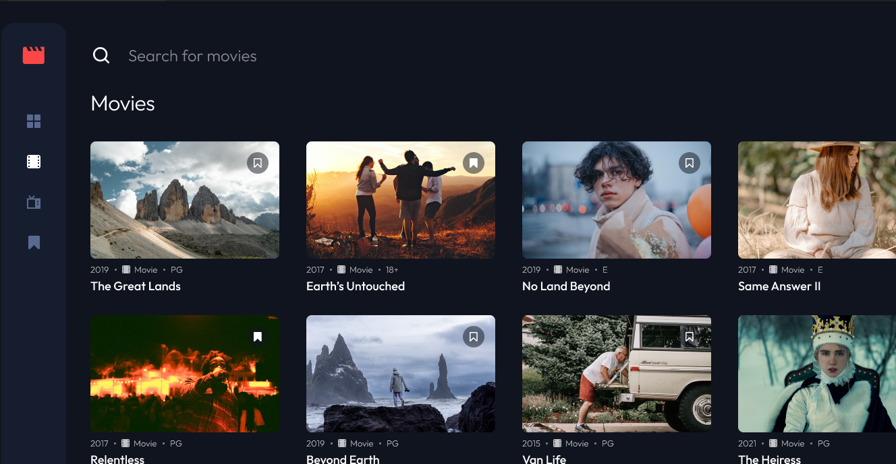

# Entertainment web app solution

## Table of contents

  - Project Title
  - Project Objective
  - Customer Requirements
  - Acceptance Criteria
  - Screenshot
  - inks
  - Built with
  - Useful resources
  - Author.

##  Project Title: 
    Entertainment web app.

## Project Objective:
  My challenge was to build out this multi-page entertainment web application and get it looking as close to the design as possible.

## Customer Requirements:
  Your users should be able to:
- View the optimal layout for the app depending on their device's screen size
- See hover states for all interactive elements on the page
- Navigate between Home, Movies, TV Series, and Bookmarked Shows pages
- Add/Remove bookmarks from all movies and TV series
- Search for relevant shows on all pages
- Visit the app URL and register with a valid email address and my desired password
- Log in into their account after my registration

## Acceptance Criteria
    1. General

a. The navigation menu should be fixed to the left for larger screens. Use the 
"Desktop - Home" page in the design as a visual reference.

2. Home

a. The trending section should scroll sideways to reveal other trending shows
b. Any search input should search through all shows (i.e., all movies and TV series)

3. Movies

a. This page should only display shows with the "Movie" category
b. Any search input should search through all movies

4. TV Series

a. This page should only display shows with the "TV Series" category
b. Any search input should search through all TV series

5. Bookmarked Shows

a. This page should display all bookmarked shows from both categories
b. Any search input should search through all bookmarked shows

6. Registration

a. The email field accepts only valid email addresses
b. The user should get a prompt when the email entered is already in the database 
(user already exists)
c. The password is a minimum of 8 characters
d. The user clicks the sign-up button and a prompt message “Confirmation email 
has been sent to the user's email address” shows.
e. The user receives the confirmation email. (Simple text with confirmation code)
f. A unique ID is what distinguishes different users.
g. The unique ID should be auto-generated once and saved in the database
h. The unique ID should exist in the database and be permanent.
i. Use local storage as your database

7. Log in

a. When a user enters a registered email address and their password used in 
registering, they should see a prompt which tells them that their login was 
successful.
b. In the case of a correct email address (registered email) and a wrong password 
combination, the system should prompt them that their password is wrong.
c. In the case of a wrong email address (unregistered email) and a password 
combination, the system should prompt them that their email address doesn’t exist 
in the system

### Screenshot

### Process

This is my solution to Amalitech capstone project on the Entertainment web app. This Frontend challenge was to help me improve on my coding skills by building realistic project.

### Links

- [Solution URL]: https://github.com/AbdulRazak2/Entertainment_web_app.git
- [Live Site URL]: https://alhassanabdulrazak.netlify.app/

### Built with

-  [React](https://reactjs.org/) - JS library
- [Styled Components](https://styled-components.com/) - For styles
- Semantic HTML5 markup
- CSS custom properties

### Useful resources

- figma:
- https://auth0.com/blog/complete-guide-to-react-user-authentication/
- https://www.youtube.com/watch?v=b9eMGE7QtTk

## Author
Alhassan Abdul-Razak
